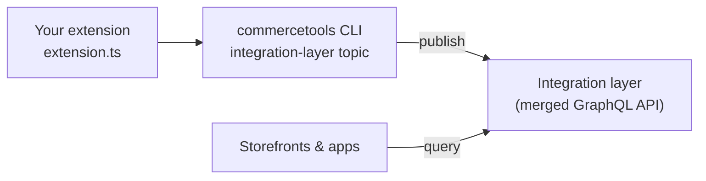
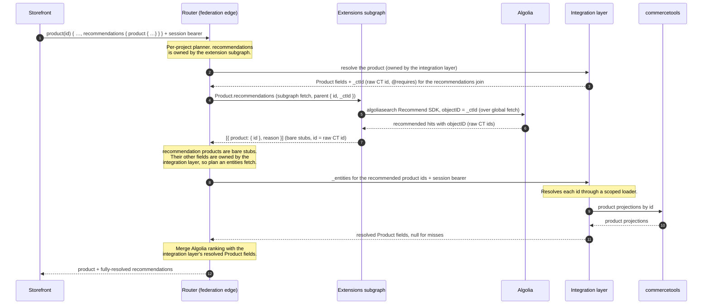

# example-extensions

Templates and tooling for writing extensions to the commercetools integration
layer.

An extension is a small GraphQL subgraph you write. It adds fields and types to the
API the integration layer already serves for your project: a new root query, an
extra field on `Product`, a value derived from data the integration layer owns, or
a field that calls an external service. You write the SDL and the resolvers, run
`commercetools integration-layer extension push`, and the merged schema goes live
with no redeploy.

There is nothing to run here. You get a set of example extensions under `examples/*`,
and the build → validate → push flow lives in the **commercetools CLI**: the
`integration-layer` topic, added by the published
`@commercetools/cli-topic-integration-layer` plugin (see
[Quickstart](#quickstart)).

## Contents

- [How it fits together](#how-it-fits-together)
- [Quickstart](#quickstart)
- [Example templates](#example-templates)
- [API Extensions](#api-extensions)
- [Schema mechanics](#schema-mechanics)
- [Resolver mechanics](#resolver-mechanics)
- [Configuring your extension securely](#configuring-your-extension-securely)
- [Develop locally (`serve`)](#develop-locally-serve)
- [Validate & publish](#validate--publish)
- [Config (`.env`)](#config-env)
- [Layout](#layout)
- [The pipeline](#the-pipeline)
- [Flow diagram](#flow-a-storefront-reading-algolia-recommendations)
- [Release](#release)

## How it fits together

You write one file. The `commercetools integration-layer` CLI publishes it. The
integration layer composes your subgraph with its own schema and serves the result
as a single GraphQL API that storefronts, the Merchant Center, and your own apps all
query.



- `extension.ts` is your subgraph: a `typeDefs` SDL string and a `resolvers` object.
- `commercetools integration-layer extension push` bundles it, validates it against
  your project, and pushes it. Your `commercetools auth login` session
  (`manage_project`) authorizes the push.
- The integration layer stores the bundle, composes it with its own schema, and
  serves the merged API. It also holds the commercetools credentials, so your
  resolvers never touch a CT token.

## Quickstart

Two steps: commercetools turns the integration layer on for your project, then you
publish.

First, ask your commercetools contact to enable the integration layer for your
project. Once it is on, the project's GraphQL endpoint is live and ready to accept
extensions. Nothing to install for this part.

Then publish:

```bash
# Install the commercetools CLI (once), then add the integration-layer topic. The
# plugin is published to the public npm registry, so no auth or scope mapping is needed.
# NB: install from @dev for now — the `plugins` command is only in the CLI's dev
# prerelease; @latest (0.0.17) predates it. Drop @dev once it ships to @latest.
npm install -g @commercetools/cli@dev
commercetools plugins install @commercetools/cli-topic-integration-layer

# Log in once — mints the manage_project token the authenticated commands reuse and
# sets your target project key
commercetools auth login --project-key <your-project-key>

# Clone this repo and install its dev dependencies (once)
git clone <this-repo> && cd integration-layer-extension-examples
pnpm install

# Work inside the template closest to what you want
cd examples/server-time
pnpm dev                # live GraphiQL at :4000; edit src/extension.ts, hot-reloads
pnpm validate           # composes against YOUR project, reports collisions/breaking changes
pnpm push               # builds + validates, then publishes; live immediately
```

`pnpm setup:cli` (from the repo root) is a shortcut for the `commercetools plugins
install …` step. Logging in with `commercetools auth login` gives you a
`manage_project` session — that is what authorizes a push, and only `validate` /
`push` (and `status` / `delete`, `schema`, `config`) use it. The `pnpm dev` /
`pnpm validate` / `pnpm push` scripts inside each example are thin aliases for
`commercetools integration-layer extension serve|validate|push`.

> The plugin is published to the public npm registry, so `commercetools plugins
> install` needs no auth or scope mapping. Releases are cut with Changesets (version +
> CHANGELOG) and published on a version tag via npm Trusted Publishing (OIDC) — no
> stored npm token. See [Release](#release).

## Example templates

Standalone templates, each showing one way a bundle can contribute. Pick the
closest one and edit its `src/extension.ts`. The `build → validate → push` flow is
identical from any of their directories.

There are **two kinds** of extension, and a bundle may export either or both:

- **GraphQL schema extensions** (`typeDefs` + `resolvers`) — ADD FIELDS to the
  graph. Seven of the templates below.
- **commercetools API Extensions** (`apiExtensions`) — a synchronous callback that
  VALIDATES or MODIFIES a cart/order/… write *before commercetools saves it* (it
  can even block it). See **cart-sku-blocker** / **cart-quantity-cap** and
  [API Extensions](#api-extensions) below. These change API *behaviour*, not the schema.

| Template | Kind | Pattern | Start here when you want to |
| --- | --- | --- | --- |
| **server-time** | schema | New type + root field (`Query.serverTime`) | add a brand-new query or type that shares nothing with the integration layer |
| **loyalty-points** | schema | Field on an entity from an *argument* (`Product.loyaltyPoints`) | add a field to every product, computed without reading any product data |
| **price-discount** | schema | Field from a value the integration layer owns via `@requires` (`Product.discountedPrice`) | compute from a field the integration layer owns (a nested value) |
| **customer-display-name** | schema | `@requires` over scalar fields (`Customer.displayName`) | compute from plain scalar fields the integration layer owns |
| **algolia-recommendations** | schema | External service returning entity stubs (`Product.recommendations`) | call out to a vendor API and return products the integration layer resolves |
| **business-unit-cost-centres** | schema | Attaching by the READABLE key, on a non-`Product` entity (`BusinessUnit.costCentres`, `@key(fields: "key")`) | extend an entity your own data keys by its human handle, not by an opaque id |
| **category-counts-override** | schema | Taking over an existing field with `@override` (`Query.categoryProductCounts`) | replace a field the integration layer already serves with your own data |
| **cart-sku-blocker** | API Extension + GraphQL | BLOCK SKUs from carts (`cart` Create/Update) *and* expose a `blockedSkus` query, from one shared config | validate a cart/order/… write before it is saved — and see one bundle do both |
| **cart-quantity-cap** | API Extension | MODIFY the write (`{ actions: [...] }`), API-extensions-only, with a `condition` | correct a write in flight instead of rejecting it, with no schema of your own |

> Each project holds one bundle, so a second push replaces the first. The templates
> are not meant to run side by side, so push one per project. To ship several
> patterns at once, combine their `typeDefs` / `resolvers` / `apiExtensions` in a
> single file.

## API Extensions

A [commercetools API Extension](https://docs.commercetools.com/api/projects/api-extensions)
is a synchronous HTTP callback commercetools makes *before it persists* a
cart/order/customer/… create or update. The callback can **approve** the write,
**modify** it (return update actions), or **block** it (return a validation error).
Unlike a schema extension, it doesn't add fields — it intercepts writes.

Export an `apiExtensions` array of handlers. A handler returns the plain runtime
contract — `{}` to approve, `{ errors: [...] }` to block, `{ actions: [...] }` to
modify. The received payload is the **commercetools SDK's own `ExtensionInput`** —
you don't define the resource types: narrow on `input.resource.typeId` and
`resource.obj` is the real `Cart` / `Order` / … (a type-only import, erased from the
bundle):

```ts
import type { Cart, ExtensionInput } from '@commercetools/platform-sdk';

export const apiExtensions = [
  {
    key: 'cart-sku-blocker',            // → commercetools extension key octolog-il-cart-sku-blocker
    resourceTypeId: 'cart',             // cart | order | customer | payment | quote | business-unit | shopping-list | …
    actions: ['Create', 'Update'],
    handler: (input: ExtensionInput, ctx: { config: Record<string, string> }) => {
      const blockedSku = ctx.config.BLOCKED_SKU || 'BLOCKED-SKU';
      // input.resource is the SDK's discriminated Reference union — narrow to
      // get a fully-typed Cart.
      const cart: Cart | undefined = input.resource.typeId === 'cart' ? input.resource.obj : undefined;
      return (cart?.lineItems ?? []).some((li) => li.variant.sku === blockedSku)
        ? { errors: [{ code: 'InvalidInput', message: `SKU "${blockedSku}" cannot be added to the cart.` }] }
        : {};
    },
  },
];
```

- **Registration is automatic.** When the bundle is deployed, the integration layer
  reads the declared `apiExtensions` and registers them with commercetools (pointing
  the destination at the extensions sandbox, with an authenticated callback). You
  don't call the commercetools Extensions API yourself.
- **Config** is read from `ctx.config` (set per project in the Merchant Center app /
  the extension config API), exactly like a resolver. Secrets are decrypted host-side.
- **Handlers run in the same sandbox** as resolvers (no ambient authority; the
  allowlist-gated global `fetch` is available for outbound calls). A handler that
  throws **fails hard**: the callback returns an error and commercetools fails the
  write — never a silent approve. The **deadline is commercetools'** (the extension's
  `timeoutInMs`, or its ~2s default); if a handler runs past it, commercetools fails
  the write itself — the sandbox imposes no second timeout. To *allow* a write,
  `approve()`; to *reject* it, `block(...)`.

The **cart-sku-blocker** example goes further: the same bundle ALSO exports a
`Query.blockedSkus` GraphQL field that returns the very SKUs it blocks, both reading
one shared `ctx.config.BLOCKED_SKU` list — so one bundle contributes both an
API-Extension callback and a GraphQL field from a single config.

### Modifying a write instead of blocking it

Blocking is the loud outcome; **modifying** is often the useful one. Return
`{ actions: [...] }` and commercetools applies those update actions as part of the
very write it asked you about — the corrected write is what gets saved, and the caller
sees no error. The actions are ordinary commercetools update actions for that resource.

**cart-quantity-cap** does exactly this: it caps a line's quantity with
`changeLineItemQuantity` rather than rejecting an over-large add. It is also the one
template that is **API-extensions-only** — no `typeDefs` at all, so `validate`/`push`
skip GraphQL composition for it — and the one that sets a **`condition`**: a
commercetools query predicate (`lineItems is not empty`) that commercetools evaluates
first, so it never calls you for a write your handler would obviously no-op on.

| Return | Outcome |
| --- | --- |
| `{}` | approve, unchanged |
| `{ actions: [...] }` | approve, having applied these update actions (**cart-quantity-cap**) |
| `{ errors: [...] }` | block the entire write (**cart-sku-blocker**) |
| *throws* | commercetools fails the write — never a silent approve |

### Try it locally

`commercetools integration-layer extension invoke` fires a sample commercetools cart
callback at your handlers and prints the result — no deploy, no credentials:

```bash
cd examples/cart-sku-blocker
pnpm dev                                                        # → extension invoke — the default (blocked) SKU
commercetools integration-layer extension invoke --sku ALLOWED  # a SKU that passes
commercetools integration-layer extension invoke --action Update --config BLOCKED_SKU=NO-SELL

cd ../cart-quantity-cap
pnpm dev                                                        # → MODIFY: the line is capped
commercetools integration-layer extension invoke --quantity 2 --config MAX_LINE_QUANTITY=10
```

Then `pnpm validate` / `pnpm push` as usual (an API-extensions-only bundle skips the
GraphQL composition check — there's no schema to compose).

## Schema mechanics

`typeDefs` is a Federation v2 SDL string. Start it by importing the federation spec
and the directives you use:

```graphql
extend schema @link(url: "https://specs.apollo.dev/federation/v2.3", import: ["@key", "@requires", "@external"])
```

### Directives

| Directive | Use it to | Notes |
| --- | --- | --- |
| `@link` | import the federation spec and the directives below | always the first line of `typeDefs` |
| `@key(fields: "id")` | mark a type as an entity you're attaching to | re-declare the key field NON-`@external` (it identifies the entity); add your new fields alongside |
| `@external` | reference a NON-key field the integration layer owns | for `@requires` only; you never resolve it. Do NOT put it on the key field — that stops the planner satisfying `@requires` (and stops you returning the entity as a stub) |
| `@requires(fields: "…")` | pull integration-layer-owned data into your resolver | the planner resolves it onto the resolver's `parent` |
| `@override(from: "integration-layer")` | take over an existing field | re-declare referenced types **and `@override` their fields too** (`examples/category-counts-override`). Works for a field whose result types are its OWN; do NOT override a field whose result reuses SHARED value types (e.g. the Relay `Query.search` → `ProductSearchConnection`, which reuses `PageInfo`/`ProductEdge`) — overriding those seizes them graph-wide and breaks other connections |
| `@shareable` | co-own a field with the integration layer | rarely needed; prefer a new field. An unshared duplicate fails composition |

The rule of thumb is to add new fields rather than redefine existing ones. If your
field only needs an integration-layer field as input, reference it with `@external`
and `@requires` instead of resolving it yourself. If you genuinely need to replace
a field, `@override` it.

The patterns below each pair a minimal SDL with its resolver;
[Resolver mechanics](#resolver-mechanics) covers the resolver side.

### A brand-new field or type

Nothing here is shared with the integration layer, so it always composes.
(`examples/server-time`.)

```graphql
extend schema @link(url: "https://specs.apollo.dev/federation/v2.3")

type Query {
  serverTime: ServerTime!
}
type ServerTime { iso: String!  epochMillis: Float!  timezone: String! }
```

```ts
export const resolvers = {
  Query: {
    serverTime: (_parent, _args, ctx) => {
      const ms = ctx.now();
      return { iso: new Date(ms).toISOString(), epochMillis: ms, timezone: "UTC" };
    },
  },
};
```

### A field on a product (or any entity)

The integration layer exposes its top-level resources as federation entities keyed
by `id`, so you can attach a field to one by re-declaring the type with its key and
your new field. In the v2 contract `Product` is a single CONCRETE object entity
(there is no interface + concrete-subtype model any more), so a plain
`type Product @key(fields: "id")` hits every product — no `@interfaceObject`. The key
field is declared NORMALLY (not `@external`): it identifies the entity the router
routes on. (`examples/loyalty-points`.)

```graphql
extend schema @link(url: "https://specs.apollo.dev/federation/v2.3", import: ["@key"])

type Product @key(fields: "id") {
  id: ID!
  loyaltyPoints(price: Float!): Int!
}
```

```ts
export const resolvers = {
  Product: {
    // parent is the entity stub the integration layer resolved: { id }
    loyaltyPoints: (_product, { price }) => Math.floor(price),
  },
};
```

The same shape works for the other object entities (`Order`, `Cart`, `Customer`, and
so on) — `type <Entity> @key(fields: "id") { id: ID!  <newField> }`. The
[entity catalog](#entity-catalog) lists them all.

```graphql
type Order @key(fields: "id") { id: ID!  priorityScore: Int! }
```

### A field computed from data the integration layer owns

When your field depends on data the integration layer owns, mark those (NON-key)
fields `@external` and name them in `@requires`. The planner fetches them and passes
them to your resolver, so you read the data without owning it. Keep the key field
(`id`) non-`@external`, or the planner can't satisfy the `@requires`.
(`examples/price-discount` for a nested value, `examples/customer-display-name` for
scalars.)

```graphql
extend schema @link(url: "https://specs.apollo.dev/federation/v2.3", import: ["@key", "@requires", "@external"])

type Money { amount: String! @external }   # v2 Money is { amount, currencyCode, formatted } — no centAmount
type Product @key(fields: "id") {
  id: ID!                                   # the key: NON-@external
  price: Money @external
  discountedPrice(percentOff: Int!): String @requires(fields: "price { amount }")
}
```

```ts
export const resolvers = {
  Product: {
    // parent carries { id } plus the @requires fields: { price: { amount } }
    discountedPrice: (product, { percentOff }) => {
      const amount = product.price?.amount;
      if (amount == null) return null;      // price is entitlement-gated → nullable
      const pct = Math.min(100, Math.max(0, percentOff));
      return ((Number(amount) * (100 - pct)) / 100).toFixed(2);
    },
  },
};
```

### A field backed by an external service

Use the global `fetch`, or any fetch-based SDK (see
[runtime constraints](#runtime-constraints)). Outbound calls are restricted to a
host allowlist the operator configures. Pull credentials from
[`ctx.config`](#configuring-your-extension-securely) rather than hard-coding them,
and make the field nullable so an outage degrades to `null` instead of taking down
the whole product. (`examples/algolia-recommendations`.)

```graphql
extend schema @link(url: "https://specs.apollo.dev/federation/v2.3", import: ["@key", "@requires", "@external"])

type Product @key(fields: "id") {
  id: ID!                                     # NON-@external: this resolver RETURNS Product stubs, so it must provide the key
  _ctId: ID! @external                        # raw CT id (integration-layer-owned, @inaccessible) — Algolia's index is keyed by it, not the opaque `id`
  recommendations: [ProductRecommendation!] @requires(fields: "_ctId")   # nullable list, safe to degrade
}
type ProductRecommendation { product: Product!  reason: String! }
```

```ts
import { algoliasearch } from "algoliasearch";        // official SDK, no special import

export const resolvers = {
  Product: {
    recommendations: async (product, _args, ctx) => {
      const { ALGOLIA_APP_ID, ALGOLIA_API_KEY, ALGOLIA_INDEX_NAME } = ctx.config;
      if (!ALGOLIA_APP_ID || !ALGOLIA_API_KEY || !ALGOLIA_INDEX_NAME) return null;  // not configured
      try {
        const client = algoliasearch(ALGOLIA_APP_ID, ALGOLIA_API_KEY);
        const res = await client.initRecommend().getRecommendations({
          // objectID is the RAW CT id — key off `_ctId`, never the opaque `product.id`.
          requests: [{ indexName: ALGOLIA_INDEX_NAME, model: "related-products", objectID: product._ctId, maxRecommendations: 5 }],
        });
        return (res.results?.[0]?.hits ?? [])
          .map((h) => ("objectID" in h ? h.objectID : undefined))
          .filter((id) => typeof id === "string")
          // Return product STUBS keyed by the raw CT id (each objectID); the core
          // resolves it leniently and fills in the rich data (see below).
          .map((id) => ({ product: { id }, reason: "related product" }));
      } catch {
        return null;   // Algolia unavailable, degrade
      }
    },
  },
};
```

The resolver returns `{ product: { id } }`, a stub. Whenever a field's type is an
entity, return only the `id` and let the router fill in the rest from the
integration layer (the join target), so callers get back the same rich shape. More
on this under [returning entities](#returning-entities-stubs).

> **`Product.id` is an opaque Relay global id — never the raw CT id.** Treat it as
> an opaque handle: don't parse it, compare it to a raw CT UUID, or key an external
> system by it. When you genuinely need the native id (an Algolia `objectID`, a
> recommender key, …), pull in `_ctId` — the raw CT id, integration-layer-owned and
> `@inaccessible` (never exposed to shoppers) — via `_ctId: ID! @external` +
> `@requires(fields: "_ctId")`, exactly as above. On the way back, a stub may carry
> a raw CT id as its `id`: the core `_entities` resolver decodes gids leniently (a
> non-gid passes through) and re-encodes the opaque id outbound. Never try to build
> the opaque id yourself — the encoding is internal to the integration layer.

### Taking over an existing field (`@override`)

To replace a field the integration layer already serves, claim it with
`@override(from: "integration-layer")`. Federation cannot import types across
subgraphs, so you re-declare the field's argument and result types and `@override`
each one. The integration layer keeps serving the field directly; the override only
changes who owns it in the routed graph.

**This works only when the field's result types are its OWN.** If the result reuses
types shared with other fields, `@override`ing those fields seizes them graph-wide
and breaks the other fields that use them. The v2 discovery field
`Query.search: ProductSearchConnection!` is exactly this trap: its
`ProductSearchConnection` reuses the shared Relay `PageInfo` and `ProductEdge`
(used by every other connection), and the integration layer emits no `@shareable`
for co-ownership — so there is no faithful way to `@override` `search` from an
extension. (v1's `algolia-recommendations` overrode a search-specific
`ProductSearchResult`, which had no shared types; v2 removed that surface, so the
example now ships the recommendations pattern only.) Reach for `@override` on a
field whose result you fully own, e.g.:

```graphql
extend schema @link(url: "https://specs.apollo.dev/federation/v2.3", import: ["@key", "@override"])

type Query {
  # a field whose result type (MyResult) is declared and owned entirely by this subgraph
  featuredProducts: MyResult! @override(from: "integration-layer")
}
type MyResult {
  items: [Product!]!   # Product is an entity: return { id } stubs, the router resolves the rest
}
```

Return product stubs in `items` and the router fills in the rest, so callers see no
difference.

**Overriding a field whose result type the integration layer also declares** takes one
more step, and `examples/category-counts-override` shows it. Re-declaring the result
type means both subgraphs define its fields, which federation rejects
("non-shareable field … resolved from multiple subgraphs"). `@override` those fields as
well — per field, not just on the root field:

```graphql
extend schema @link(url: "https://specs.apollo.dev/federation/v2.3", import: ["@key", "@override"])

type Query {
  categoryProductCounts(categoryIds: [ID!]): [CategoryProductCount!]! @override(from: "integration-layer")
}
type CategoryProductCount {
  category: Category! @override(from: "integration-layer")   # both fields, or composition fails
  count: Int! @override(from: "integration-layer")
}
type Category @key(fields: "id") { id: ID! }                 # an entity: key only, return { id } stubs
```

`@shareable` is NOT an alternative here: the integration layer does not mark its own
copy shareable, and co-ownership needs both sides to agree.

And note what you take on. You now own the field's **availability**: its signature is
fixed (you cannot make a non-null result nullable), so if your service is down the
field errors — an additive field could have degraded to `null`. If that trade isn't
worth it, add a new field instead of overriding one.

### Entity catalog

These are the only types you can extend. All are keyed by `id`; the ones with a
`key` field can also be keyed by `key`, letting you attach by the readable handle
instead of the opaque id.

| Type | `id` key | `key` key | Notes |
| --- | --- | --- | --- |
| `Product` | yes | optional | concrete object entity (v2 — no interface); `type Product @key(fields: "id")` |
| `Customer`, `BusinessUnit`, `Category`, `ApprovalRule`, `RecurrencePolicy` | yes | yes | `@key` by `id` or the readable `key` |
| `Cart`, `Order`, `Quote`, `QuoteRequest`, `Review`, `ShoppingList`, `ApprovalFlow`, `RecurringOrder` | yes | n/a | `id`-only (`ShoppingList` is v2's unified wishlist + purchase list) |
| `AssociateRole` | n/a | yes | `key`-only (v2 exposes just `{ key, name }`) |

Keying by an optional `key` is a judgement call: the field only resolves for
instances that actually have one, and a non-null field nulls out where the key is
missing — stick with `id` unless you need the readable handle.

Reach for the readable handle when your own data is keyed by it too — a config map or
a finance-system table a human maintains per business unit, per category. Then the
router hands your resolver `{ key: "acme-eu" }` and you look straight up, instead of
keeping a second table of opaque ids. `examples/business-unit-cost-centres`:

```graphql
type BusinessUnit @key(fields: "key") {
  key: String!                # the key: declared NORMALLY, not @external
  costCentres: [String!]!
}
```

(`BusinessUnit.key` and `Category.key` are non-null in the integration layer's schema,
so this is safe for them; check before keying by a `key` that may be null.)

**No nested types are extensibly keyed in the current v2 surface.** (v1 let you
`@requires`-decorate a keyed `ProductPrice` and `Address`; v2 has no standalone
`ProductPrice` entity, and `Address` is now a keyless embedded snapshot — the
address book moved to `SavedAddress`, which is not an extensible/join-target
entity.) Compute price/address-derived fields on the OWNING entity instead — e.g.
`Product.discountedPrice` from `Product.price` (`examples/price-discount`), or a
scalar-derived field on `Customer` (`examples/customer-display-name`).

Everything else is off limits: value types (`Money`, images), reference wrappers
(`*Ref`), embedded sub-objects (`LineItem`, `Address`), and product variants (whose
`id` is a per-product composite, not a global entity key).

## Resolver mechanics

A resolver is a function at `resolvers[Type][field]`, with the standard GraphQL
signature `(parent, args, ctx)`:

```ts
fieldName: (parent, args, ctx) => result            // sync
fieldName: async (parent, args, ctx) => result       // async (e.g. a fetch)
```

- `parent` is whatever the field hangs off. Root fields (`Query.*`) ignore it; on an
  entity field it is the representation the integration layer resolved, `{ id }`,
  plus anything you pulled in with `@requires`. So
  `@requires(fields: "price { amount }")` gives you `{ id, price: { amount } }`
  and nothing you did not ask for.
- `args` is the field's arguments, typed as you declared them in the SDL.
- `ctx` carries the host's capabilities. The runtime is sandboxed (see
  [Runtime constraints](#runtime-constraints)), so anything beyond plain computation
  and `fetch` reaches you here: `ctx.now()` returns the current epoch-millis (a
  convenience; `Date.now()` works too), and `ctx.config` is the per-project
  `{ key: value }` config map (secrets decrypted host-side, read-only, empty when
  nothing is set; see [Configuring securely](#configuring-your-extension-securely)).

### Returning entities (stubs)

When a field returns an entity (a `Product`, or a list of them), return just its
`id`. The router re-enters the integration layer by that key (it is a join target
for `Product`) and resolves whatever fields the caller asked for. Your resolver
decides which entities to return and in what order; the integration layer stays the
source of truth for their contents. Non-entity types you return in full, as usual.

### Errors and graceful degradation

Throw a `GraphQLError` (imported from `graphql`, the one package the host provides)
to fail a field on purpose. For anything that can fail transiently, like an
external call, prefer a nullable field and return `null` on failure so the rest of
the response survives; a non-null field that throws nulls out its parent instead.
The Algolia template degrades both `recommendations` and the search result this way.

### Runtime constraints

Resolvers run in a sandbox, not a full Node process. esbuild bundles `extension.ts`
and everything it imports into one self-contained CommonJS module.

- **Available:** the standard web-platform data globals — `fetch` (allowlisted);
  `setTimeout`/`clearTimeout`; `Date`; `Math`; `URL`/`URLSearchParams`;
  `TextEncoder`/`TextDecoder`; `btoa`/`atob`; the fetch types `Headers`/`Request`/
  `Response`/`FormData`; `structuredClone`; `Intl`; `AbortController`/`AbortSignal`
  — plus the ECMAScript intrinsics (`JSON`, `Map`, typed arrays, …). Most fetch-based
  SDKs work unmodified.
- **Off limits:** `process`/`process.env`, `Buffer`, `fs`, `child_process`, raw
  sockets, Node built-ins (`node:*`), `eval`, `new Function`, `setInterval`, and the
  deliberately-withheld web globals `SharedArrayBuffer`/`Atomics`, `WebAssembly`,
  `MessageChannel`/`BroadcastChannel`, `WeakRef`/`FinalizationRegistry`,
  `performance`, and `CompressionStream`/`DecompressionStream` (channels, DoS
  amplifiers, or side channels). Config comes from `ctx.config`, not the environment.
  `validate`/`push` flag a reach for a non-endowed global before you deploy.
- **Imports:** local modules and npm SDKs get inlined; `graphql` stays external
  (the host provides it, and a second copy would break its `instanceof` checks).
- **Network:** only through `fetch`, only to allowlisted hosts, and anything else is
  refused before the socket opens. Your SDK has to be fetch-based, since there is no
  Node `http`/`https` for it to fall back to.

`pnpm validate` catches most of these statically before you push.

## Configuring your extension securely

Most extensions need some per-project settings: an API key, a hostname, an index
name. Do not hard-code them. The bundle is committed source and identical across
projects, so settings belong in your project's extension configuration, which your
resolver reads from `ctx.config`:

```ts
// In your resolver: a flat, read-only string map. Secrets are decrypted host-side.
const apiKey = ctx.config.MY_API_KEY;
const host   = ctx.config.MY_SERVICE_HOST;
if (!apiKey) return null;          // degrade gracefully when unset
```

### Plain values vs. secrets

Every entry is `{ key, value, secret? }`. A plain entry (the default) is something
non-sensitive like a hostname or a feature flag, stored and read back as-is. A
secret entry (`secret: true`) is a credential: it is encrypted at rest, never
returned by any read (you see the key but not the value), and never written into
your bundle. The host decrypts it only when resolving a request.

Either way it shows up in `ctx.config` as a plain string. The `secret` flag governs
storage and exposure, not how you read it.

### Setting configuration

Both paths require the `manage_project` scope, the same as publishing.

The easy way is the integration layer's Merchant Center console, which has a
per-project Extension configuration view for adding entries and flagging the secret
ones. No tokens to juggle.

For automation, the CLI's `config` commands reuse your `commercetools auth login`
session — no tokens to juggle:

```bash
commercetools integration-layer config set ALGOLIA_APP_ID ABC123
commercetools integration-layer config set ALGOLIA_INDEX_NAME products
commercetools integration-layer config set ALGOLIA_API_KEY search-only-key --secret
commercetools integration-layer config list           # secret VALUES are masked
commercetools integration-layer config unset OLD_SETTING
```

Or hit the config endpoint directly with any `manage_project` bearer token (`$TOKEN`
below — e.g. one minted by a `manage_project` API Client via the client-credentials
flow, or your login token). Send `[{ key, value, secret? }]` to
`…/api/<project>/extensions/config`:

```bash
# Replace the WHOLE config (PUT): the posted set becomes the project's entire config
curl -X PUT "$INTEGRATION_LAYER_URL/api/$CTP_PROJECT_KEY/extensions/config" \
  -H "Authorization: Bearer $TOKEN" -H 'Content-Type: application/json' \
  -d '[
        { "key": "ALGOLIA_APP_ID",     "value": "ABC123" },
        { "key": "ALGOLIA_INDEX_NAME", "value": "products" },
        { "key": "ALGOLIA_API_KEY",    "value": "search-only-key", "secret": true }
      ]'

# Upsert a few entries without touching the rest (PATCH); value:null deletes a key
curl -X PATCH "$INTEGRATION_LAYER_URL/api/$CTP_PROJECT_KEY/extensions/config" \
  -H "Authorization: Bearer $TOKEN" -H 'Content-Type: application/json' \
  -d '[{ "key": "ALGOLIA_API_KEY", "value": "rotated-key", "secret": true },
       { "key": "OLD_SETTING", "value": null }]'

# List current entries (secret VALUES are withheld; you see the key + secret:true)
curl "$INTEGRATION_LAYER_URL/api/$CTP_PROJECT_KEY/extensions/config" \
  -H "Authorization: Bearer $TOKEN"
```

| Method | Effect |
| --- | --- |
| `GET` | list entries, secret values withheld (you get `{ key, secret: true }`) |
| `PUT` | replace the entire config with the posted array |
| `PATCH` | upsert the posted entries; `value: null` deletes that key, the rest untouched |

Config changes take effect on their own. You do not republish the bundle to pick up
new values.

### Configuring for local development

`pnpm dev` has no integration layer to read from, so it pulls `ctx.config` from
`EXTENSION_CONFIG_*` variables: `EXTENSION_CONFIG_ALGOLIA_API_KEY` becomes
`ctx.config.ALGOLIA_API_KEY`. Set them in your shell or a gitignored env file:

```bash
EXTENSION_CONFIG_ALGOLIA_APP_ID=ABC123 \
EXTENSION_CONFIG_ALGOLIA_INDEX_NAME=products \
EXTENSION_CONFIG_ALGOLIA_API_KEY=search-only-key \
  pnpm dev
```

### Good practice

- Use least-privilege credentials: a search-only Algolia key for a search resolver,
  never an admin key.
- Treat missing config as "not configured" and return `null` or an empty result, so
  an unconfigured project still serves everything else. The templates all do this.
- Keep secrets out of `extension.ts` and out of the bundle — store them as `secret`
  config entries instead. Authentication is your `commercetools auth login` session,
  not a committed file; `.env` here holds only optional overrides and is gitignored.

## Develop locally (`serve`)

`commercetools integration-layer extension serve` (`pnpm dev`) runs your example as a
live GraphQL server with GraphiQL and esbuild watch, so you get a real inner loop. It builds the same bundle the
runtime loads, serves it as an Apollo Federation v2 subgraph, and calls your
resolvers with the same `ctx` they would get in production (`ctx.now()`, and
`ctx.config` from `EXTENSION_CONFIG_*`). Save the file and the schema reloads.

```bash
cd examples/loyalty-points
pnpm dev                        # standalone: the extension subgraph at :4000/graphql
pnpm dev --compose              # + the FULL merged schema (extension + integration layer)
pnpm dev --gateway              # /graphql becomes a federated gateway over both
pnpm dev --gateway --port 4005  # (pick a port)
```

> Pass flags from inside the example (`pnpm dev --gateway`). The root
> `pnpm dev:<example>` shortcut only covers the default mode; flags do not survive
> its two pnpm layers.

- **standalone** (offline): query your fields directly, or exercise entity-extension
  fields like `Product.loyaltyPoints` through the `_entities` query. No setup.
- **`--compose`**: pulls your project's integration-layer SDL and composes it with
  your extension, exactly as publish does. The merged schema is browsable at
  `/composed`, with SDL at `/schema.graphql` and `/supergraph.graphql`. A
  non-composable edit logs the collisions and keeps the last good schema up; fix and
  save to recompose.
- **`--gateway`**: turns `/graphql` into a real federated gateway over your local
  extension plus the deployed integration layer. A query like
  `{ product(id:…) { name loyaltyPoints(price:…) } }` resolves `name` upstream and
  `loyaltyPoints` locally in one request, the production setup in miniature. It mints
  an anonymous session for its upstream calls and exposes the raw subgraph at
  `/_extension`.

> `--compose` and `--gateway` reach the real integration layer, so point
> `INTEGRATION_LAYER_URL` at your deployment. Standalone needs nothing.

## Validate & publish

Both `validate` and `push` run the bundle through two gates before it can land.

Local checks run offline and always apply:

1. **Static analysis** of your source, rejecting things that will not run in the
   sandbox (`process`, Node imports, `eval`). It is a lint to catch mistakes early,
   not the security boundary; the runtime enforces that.
2. **Shape and coherence**: a non-empty `typeDefs`, a `resolvers` object, and a
   resolver for every type and field the SDL declares (a typo that would silently
   no-op gets caught here), plus the shape of each `apiExtensions` entry. A bundle
   must contribute at least one of the two.

Remote checks need a `commercetools auth login` session and run against your project,
the same way publishing does:

3. **Composition**: your extension is composed with your project's live
   integration-layer subgraph, surfacing bad SDL and collisions (a type or field
   that already exists with a different shape). This is the only place composition
   happens.
4. **Breaking-change detection** against your currently published schema, catching a
   removed or narrowed field that consumers rely on. A project's first extension has
   no baseline, so only check 3 applies.

A failure stops the push with a specific message. If a breaking change is deliberate
and coordinated, override the remote checks (3 and 4) with `--force`:

```bash
commercetools integration-layer extension push --force
```

The local checks (1 and 2) always fail hard, regardless of `--force`. A bundle that
will not load, reaches outside the sandbox, or has resolvers that do not match its
SDL is broken no matter what you intended. (Run the CLI directly for flags like
`--force`; a bare `pnpm push --force` may be swallowed by pnpm — use `pnpm push --
--force` to forward it.)

### Which revision is deployed (`sourceRevision`)

Every push records **your own version-control revision** for the bundle, so you can
tell which of your commits a project is actually running. `push` reads it from the
working copy — no flag, nothing to configure:

```
$ commercetools integration-layer extension push
Source revision: v1.4.2-3-g1a2b3c4d-dirty
...
✓ stored revision 7 (18213 bytes, filename extension.cjs)
  built from v1.4.2-3-g1a2b3c4d-dirty
```

It is `git describe --tags --always`, so you get the most meaningful identifier
available: an exact tag (`v1.4.2`), a tag plus distance and commit
(`v1.4.2-3-g1a2b3c4d`), or the bare commit if you have no tags. A `-dirty` suffix
means the directory you pushed from had uncommitted **or untracked** changes — the
artifact isn't the tagged code, and the recorded revision says so.

Once stored, the revision shows up in three places:

- `commercetools integration-layer extension status` — `built from: …`
- the **Merchant Center** extension panel, next to the stored bundle
- every log line the extension runtime emits, as `extension_source_revision`
- and over GraphQL, on any project's endpoint:

  ```graphql
  { _extensionBundle { version sourceRevision } }
  ```

  A platform-provided field on every extension subgraph — you don't declare it, and
  it answers "what is deployed right now?" without leaving your API client.

**Not using git?** The integration layer stores the value as an opaque string, so pass
whatever identifies a revision in your system — an hg/svn/Perforce id, a CI build
number:

```bash
commercetools integration-layer extension push --source-revision r48211
# or, in CI:
EXTENSION_SOURCE_REVISION="$BUILD_ID" commercetools integration-layer extension push
```

Use `--no-source-revision` to push without recording one. Nothing is recorded when
there's nothing to detect either — a value is never invented, since a made-up
revision in the Merchant Center and in every log line is worse than none.

## Explore your project's graph (`explore`)

```bash
commercetools integration-layer explore
```

Starts a local GraphQL explorer in your browser. One command: it resolves your
project's schema, mints a session from your existing `commercetools auth login`,
serves GraphiQL on `http://localhost:4000`, and proxies every operation to your
project's **deployed** edge. No tokens to paste, no headers to hand-edit.

| Flag | What it does |
| --- | --- |
| `--deployed` | Render the project's **deployed composed schema** (read from Hive — core subgraph + whichever extension is actually deployed) instead of composing locally |
| `--as <email>` | Run operations as that customer, via an ordinary email/password login (prompts for the password, or set `IL_CUSTOMER_PASSWORD`). Omit to run anonymously |
| `-p, --port` | Port to serve on (default `4000`) |
| `--graphql-url` / `--auth-url` | Override the GraphQL and identity edges (`IL_GRAPHQL_URL` / `IL_AUTH_URL`); needed for staging zones, which don't follow the production host convention |

**Two schema sources.** By default the explorer composes locally: your project's
core-subgraph SDL plus, when you run it from an extension directory, that
extension — built from the working tree. So your fields show up before you have
pushed anything. `--deployed` instead reads what the router actually serves, which
is what you want when you're debugging the real edge rather than your own draft.

**How auth works, and what it deliberately doesn't do.** Operations run as an
anonymous shopper, or as a real customer who logs in with their own credentials.
There is no impersonation flag and no privileged debug identity — to see what a
customer sees, you log in as them. (The Merchant Center console used to have an
operator "Run as" bar that executed under the project's service-account
credentials; that is exactly what this does not reimplement.)

**Why introspection is answered locally.** The deployed edge runs with
introspection disabled — a project's schema is not public. The explorer therefore
reads the schema over an authenticated API (`GET /<project>/schema/api`, or
`/subgraph` for the local composition) and answers GraphiQL's introspection itself,
so you get full docs and autocomplete against an edge that gives no schema away.
Only real operations are forwarded, and the session bearer is attached by the CLI
on the way out — it is never exposed to the browser page.

### All commands


Repo-wide (from the repo root):

```bash
pnpm setup:cli    # install the integration-layer CLI plugin (once)
pnpm install      # install dev dependencies (once)
pnpm typecheck    # tsc --noEmit across all examples
pnpm lint         # eslint . (shared root config)
pnpm build        # commercetools integration-layer extension build → each example's dist/ (needs the CLI plugin)

# Per-example validate/push from the root (need `commercetools auth login`):
pnpm validate:<name>   pnpm push:<name>   # <name> = server-time | loyalty-points | …
```

Per-example (the day-to-day flow), from inside `examples/<name>`:

```bash
pnpm dev        # the example's inner loop (below)
pnpm build      # build dist/extension.js
pnpm validate   # local + remote validation
pnpm push       # build + validate + publish
```

`pnpm dev` runs whichever inner loop suits the example's kind: `extension serve` for a
schema extension (a live GraphQL server), or `extension invoke` for one whose surface is
an API-Extension handler (fires a sample cart callback at it).

`typecheck`/`lint` are offline; `build`/`dev`/`validate`/`push` run through the
commercetools CLI, and `validate`/`push` also talk to the integration layer using
your `commercetools auth login` session.

## Config (`.env`)

Authentication is handled by `commercetools auth login`, not by `.env` — the login
mints the `manage_project` token the authenticated commands reuse and carries your
target project key. `.env` (copy `.env.example`) now holds only optional overrides:

| Var | What it is |
| --- | --- |
| `INTEGRATION_LAYER_URL` | OPTIONAL override of the integration layer edge base URL (defaults to the deployed instance; `http://localhost:8080` for a local one) |
| `EXTENSION_CONFIG_<KEY>` | OPTIONAL, local-only: feeds `ctx.config.<KEY>` to `serve` / `invoke`, which have no integration layer to read config from |

To target a different project, log in with a different `--project-key` (or pass
`--project-key` to a command). The `.env` is gitignored.

## Layout

```
integration-layer-extension-examples/
├── .env.example                 # optional local overrides (auth is `commercetools auth login`)
├── eslint.config.js             # shared flat config; `pnpm lint` runs `eslint .`
└── examples/
    ├── server-time/             # @example-extensions/server-time
    │   └── src/extension.ts      #   the template (the only file you edit)
    ├── loyalty-points/
    ├── price-discount/
    ├── customer-display-name/
    ├── algolia-recommendations/
    ├── business-unit-cost-centres/
    ├── category-counts-override/
    ├── cart-sku-blocker/
    └── cart-quantity-cap/
```

The build → validate → push flow is the `integration-layer` topic of the
commercetools CLI (the published `@commercetools/cli-topic-integration-layer`
plugin). Its commands work out the template's entry and output from the directory you
run them in (`<example>/src/extension.ts` → `<example>/dist/extension.js`), so the
same flow runs from any example.

## The pipeline

```
examples/<name>  ──push──▶  integration layer            extensions runtime
  src/extension.ts          PUT /api/<project>/extensions   GET /api/<project>/extensions
  → esbuild → dist/         (per-project store) ──────────▶ build subgraph + serve
  → validate (local+remote) ─▶                               + (re)publish SDL
```

1. You write `extension.ts`, exporting `typeDefs` and `resolvers`. esbuild bundles
   it into one CommonJS module (`graphql` stays external; the host supplies it).
2. `pnpm push` builds, validates locally and remotely, and only then PUTs the bundle
   into the integration layer's store, authenticating with a `manage_project` token.
   Anything broken or breaking fails before it gets there.
3. The integration layer fetches the bundle, serves the subgraph, and publishes its
   SDL to the schema registry. Edit, push, and the live extension changes, with no
   redeploy.

## Flow: a storefront reading Algolia recommendations

When the `algolia-recommendations` extension is live, a storefront asks for a
product plus its `recommendations`. The extension ranks the recommended products
with Algolia and returns them as bare `Product` stubs; the rich product detail
(for the product AND each recommendation) still comes from the integration layer
(the federation join target). The router runs the whole plan, so the storefront
sends one query and gets back fully-resolved products.



The trust boundary stays in the integration layer. The `_entities` re-entry runs
through the same session-scoped loader as a direct `products(ids:)` read, and the
integration layer re-checks the URL's project against the session bearer. The
router's routing is a hint, not the boundary.

## Release

Only `@commercetools/cli-topic-integration-layer` (under `packages/`) is published; the
`examples/*` are `private` and never released. Versioning + changelog are driven by
[Changesets](https://github.com/changesets/changesets); publishing is a separate
tag-triggered step.

The flow, in order:

1. **In your PR**, add a changeset describing the change:

```bash
pnpm changeset
```

   Choose the bump (`patch` / `minor` / `major`) and write a one-line summary — it
   becomes the CHANGELOG entry. Commit the generated `.changeset/<name>.md`. A PR that
   doesn't change the plugin (docs, an example-only edit) needs none.

2. **On merge to `main`**, `.github/workflows/release.yml` collects pending changesets
   and opens/updates a **"Version Packages"** PR that bumps `package.json` and writes the
   CHANGELOG. Nothing is published yet.

3. **Merging the Version Packages PR** pushes a `v<version>` tag, which triggers
   `.github/workflows/publish-release.yml` to publish to the public npm registry via npm
   Trusted Publishing (OIDC) — no stored token.

`package.json` + the tag remain the single publish gate; Changesets just produces both.

The repo ruleset requires **verified signatures**, so the Version Packages commit is
created via the GitHub API (`commitMode: github-api`), which GitHub signs — a plain
local commit would be rejected. Two secrets are optional (both off by default):

- `RELEASE_TAG_PUSH_TOKEN` — makes step 3's tag trigger `publish-release.yml` (a
  `GITHUB_TOKEN`-pushed tag can't start another workflow). A fine-grained PAT with
  `contents:write`, or a GitHub App token. Without it the tag is still pushed, but a
  maintainer re-pushes it once to publish.
- `CHANGESETS_APP_TOKEN` — set to the CT Changesets App token if you also want the
  Version Packages PR to trigger CI. Must be `GITHUB_TOKEN` or a GitHub App token (App
  API commits stay verified) — **not** a plain user PAT, whose API commits are
  unverified and would fail the signature rule.

See the header of `.github/workflows/release.yml` for details.
