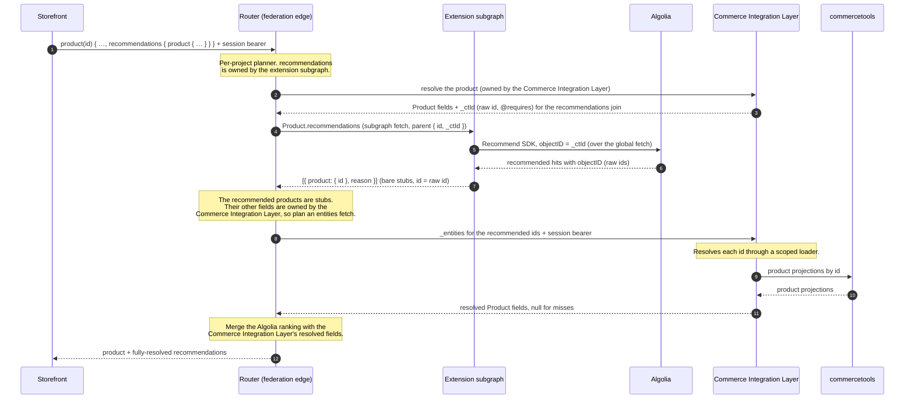

# Extension authoring: the details

The [Commerce Integration Layer documentation][docs] is the model: what an extension is, the
federation concepts, the four schema patterns, the entity catalog, the resolver
signature, the sandbox, configuration, and the publish gate. Read it first —
[GraphQL federation][fed] and [Schema extensions][schema] in particular.

This page is the layer underneath: the sharp edges you hit once you are actually
writing one. Nothing here is repeated from the docs site; every section is something
the reference doesn't cover.

- [What `parent` actually contains](#what-parent-actually-contains)
- [Ids: opaque handles and `_ctId`](#ids-opaque-handles-and-_ctid)
- [`@override`: what you are taking on](#override-what-you-are-taking-on)
- [Attaching by the readable `key`](#attaching-by-the-readable-key)
- [What is *not* extensible, and why](#what-is-not-extensible-and-why)
- [The sandbox, exactly](#the-sandbox-exactly)
- [What happens after `push`](#what-happens-after-push)
- [Recording which revision is deployed](#recording-which-revision-is-deployed)
- [Configuration beyond the CLI](#configuration-beyond-the-cli)
- [What a request actually does](#what-a-request-actually-does)

[docs]: https://docs.commercetools.com/integration-layer
[fed]: https://docs.commercetools.com/integration-layer/graphql-federation
[schema]: https://docs.commercetools.com/integration-layer/schema-extensions
[apiext]: https://docs.commercetools.com/integration-layer/api-extensions

## What `parent` actually contains

The docs say `parent` is "the representation the Commerce Integration Layer resolved, plus
anything you pulled in with `@requires`". In practice that means it contains **only**
that — there is no ambient product object to fall back on, and reading a field you
didn't ask for returns `undefined`, not data.

| Your field | What `parent` is |
| --- | --- |
| `Query.serverTime` (root) | ignored — root fields have no meaningful parent |
| `Product.loyaltyPoints(price:)` (no `@requires`) | `{ id }` — the key, nothing else |
| `Product.discountedPrice` with `@requires(fields: "price { amount }")` | `{ id, price: { amount } }` — and `price.currencyCode` is **absent**, because you didn't name it |
| `BusinessUnit.costCentres` on `@key(fields: "key")` | `{ key }` — the key you declared, not `id` |

So `@requires` is a precise request, not a hint: name every leaf you read, including
the nested ones. A field that silently reads `product.price.currencyCode` without
requiring it will be `undefined` in production and may still look fine in a
standalone `serve`, where you hand-write the `_entities` representation yourself.

## Ids: opaque handles and `_ctId`

`Product.id` is an **opaque Relay global id**, not the raw commercetools id. Treat it
as a handle: don't parse it, don't compare it to a commercetools UUID, and don't key
an external system by it. The encoding is internal to the Commerce Integration Layer and is
free to change.

When you genuinely need the native id — an Algolia `objectID`, a recommender key, a
row in your own warehouse — pull in `_ctId`, the raw commercetools id. It is
Integration-Layer-owned and `@inaccessible`, so it never appears in the shopper-facing
schema, but an extension can require it:

```graphql
type Product @key(fields: "id") {
  id: ID! @external
  _ctId: ID! @external
  recommendations: [ProductRecommendation!] @requires(fields: "_ctId")
}
```

Two asymmetries are worth knowing, because they are what make the round trip work:

- **Inbound**, you get exactly what you required: `{ id: <opaque>, _ctId: <raw> }`.
- **Outbound**, a stub you return may carry **either**. The core `_entities` resolver
  decodes global ids leniently — a value that isn't a gid passes through as a raw id —
  and re-encodes the opaque id on the way out. That's why the Algolia template can map
  `objectID` (a raw commercetools id) straight into `{ product: { id: objectID } }`
  without translating it first.

Never try to construct an opaque id yourself.

## `@override`: what you are taking on

The docs say to use `@override` sparingly and only when the field's result types are
its own. Here is what goes wrong when they aren't, and what the second step is when
you own the result type but the core subgraph declares it too.

### The shared-result-type trap

`@override` moves ownership of a field. If that field's result type is **shared with
other fields**, overriding it seizes the type graph-wide and breaks every other field
that uses it.

`Query.search: ProductSearchConnection!` is exactly this trap. `ProductSearchConnection`
reuses the shared Relay `PageInfo` and `ProductEdge`, which every other connection in
the schema also uses, and the core subgraph does not mark them `@shareable`. There is
no faithful way to `@override` `search` from an extension: you cannot re-declare its
result types without taking `PageInfo` and `ProductEdge` away from everything else.

Before you override, check whether the result type appears anywhere else in the
schema. If it does, add a new field instead.

### Overriding a field whose result type the core subgraph also declares

When you own the shape but the core subgraph declares the same result type,
re-declaring it means both subgraphs define its fields — which federation rejects with
*"non-shareable field … resolved from multiple subgraphs"*. The fix is to `@override`
**each field of the result type as well**, not just the root field:

```graphql
extend schema @link(url: "https://specs.apollo.dev/federation/v2.3", import: ["@key", "@override"])

type Query {
  categoryProductCounts(categoryIds: [ID!]): [CategoryProductCount!]! @override(from: "integration-layer")
}
type CategoryProductCount {
  category: Category! @override(from: "integration-layer")   # both fields, or composition fails
  count: Int! @override(from: "integration-layer")
}
type Category @key(fields: "id") { id: ID! }                 # an entity: key only, return { id } stubs
```

`@shareable` is **not** an alternative. Co-ownership requires both sides to agree, and
the core subgraph does not mark its copy shareable.

See `examples/category-counts-override` for the whole working bundle.

### You now own availability

An additive field can be nullable, so an outage degrades to `null`. An overridden
field's signature is **fixed by the core subgraph** — you cannot make a non-null
result nullable — so if your service is down, the field errors, and a non-null field
that errors nulls out its parent. That is a real availability trade. If it isn't worth
it, add a new field rather than override one.

## Attaching by the readable `key`

The entity catalog marks some entities as keyable by `key` as well as `id`. Reach for
it when **your own data is keyed by the readable handle too** — a finance table of
cost centres per business unit, a config map per category. The router then hands your
resolver `{ key: "acme-eu" }` and you look straight up, instead of maintaining a
second table of opaque ids:

```graphql
type BusinessUnit @key(fields: "key") {
  key: String!                # the key: declared NORMALLY, not @external
  costCentres: [String!]!
}
```

The caveat the catalog implies but doesn't spell out: keying by an **optional** `key`
means the field only resolves for instances that actually have one, and a non-null
field nulls out where the key is missing. `BusinessUnit.key` and `Category.key` are
non-null in the Commerce Integration Layer's schema, so both are safe; check before keying by a
`key` that may be null. Otherwise stick with `id`.

See `examples/business-unit-cost-centres`.

## What is *not* extensible, and why

The docs list the extensible entities and say value types, reference wrappers,
embedded sub-objects, and variants are not. The reason matters when you're looking for
somewhere to hang a field:

- **No nested type is extensibly keyed** in the current API surface. There is no
  standalone `ProductPrice` entity, and `Address` is a keyless embedded snapshot (the
  address book is `SavedAddress`, which is not a join target). So there is nowhere to
  attach a price- or address-derived field directly.
- **Compute it on the owning entity instead.** `Product.discountedPrice` from
  `Product.price` (`examples/price-discount`), or a scalar-derived field on `Customer`
  (`examples/customer-display-name`). `@requires` reaches into the nested value for
  you; you just declare the field one level up.
- **Product variants** are not entities: a variant `id` is a per-product composite,
  not a global entity key.

## The sandbox, exactly

The docs give the shape of the sandbox. This is the full endowment list, including the
globals that are **deliberately withheld** even though they are standard web platform —
the ones most likely to surprise you, because they exist in your editor's types and in
`node`, and only fail when the bundle runs.

**Available**

| Group | Globals |
| --- | --- |
| Network | `fetch` (allowlisted), `Headers`, `Request`, `Response`, `FormData`, `AbortController`, `AbortSignal` |
| Time | `setTimeout`, `clearTimeout`, `Date` |
| Text and data | `TextEncoder`, `TextDecoder`, `btoa`, `atob`, `URL`, `URLSearchParams`, `structuredClone`, `Intl` |
| Language intrinsics | `JSON`, `Math`, `Map`, `Set`, typed arrays, and the rest of ECMAScript |

`fetch` is allowlisted per Project, and **you manage that allowlist yourself** with
[`allowlist add|list|remove|set`](cli.md#allowlist) — a call to a host you haven't
allowed is refused before the socket opens, so adding the host is step one of any
external-service extension. An operator denylist sits above yours and wins; `allowlist
list` shows it.

The Node `http`/`https` modules are the one exception to "no `node:*`": you may
`import https from "https"` (or `node:https`), but you get a **shim, not the real
module** — its `request`/`get` route through the very same allowlist-gated `fetch`,
with no raw socket. So a plain-`https` SDK works, and it obeys the same per-Project
allowlist (an unallowed host raises an `'error'` event exactly as `fetch` would throw).

**Off limits**

| Group | Withheld | Why |
| --- | --- | --- |
| Node | `process` / `process.env`, `Buffer`, `fs`, `child_process`, raw sockets, any `node:*` import (except `http`/`https`, which resolve to the gated-`fetch` shim) | no ambient authority; configuration comes from `ctx.config`, not the environment |
| Dynamic code | `eval`, `new Function` | code that isn't in the bundle can't be reviewed by the publish gate |
| Unbounded scheduling | `setInterval` | a resolver has a request lifetime, not a background one |
| Shared memory | `SharedArrayBuffer`, `Atomics` | side channels |
| Channels | `MessageChannel`, `BroadcastChannel` | cross-request communication |
| Other | `WebAssembly`, `WeakRef`, `FinalizationRegistry`, `performance`, `CompressionStream`, `DecompressionStream` | DoS amplifiers, side channels, or non-determinism with no use case yet |

**Imports.** esbuild inlines your local modules and any npm SDK you import into one
self-contained CommonJS module. Two things stay **external** for the host to supply:
**`graphql`** — a second copy in the bundle would break its `instanceof` checks (a
`GraphQLError` you threw would not be recognised as one) — and **`http`/`https`**,
which the runtime maps to the gated-`fetch` shim. A fetch-based SDK is still the
smoothest path, but a plain-`https` one now works too (through that shim).

**The static check is a lint, not the boundary.** `validate` and `push` reject a reach
for a non-endowed global before you deploy, which is there to save you a round trip.
The runtime is what actually enforces the sandbox.

## What happens after `push`

A `push` **stores** the bundle. It does not load it. The extension picks the new
version up on its own poll, tries to load it, and reports back — so every stored
revision moves through a lifecycle:

| State | Meaning |
| --- | --- |
| `pending` | stored, not yet loaded by an extension runtime |
| `running` | loaded, and its schema published — the bundle works |
| `failed` | a runtime couldn't load it, with a `reason` |

Three consequences worth designing around:

- **`push` waits for the verdict by default.** It polls until your version leaves
  `pending`, then exits non-zero only on a genuine `failed`. Use `--no-wait` to return
  as soon as the bytes land, and `--wait-timeout <seconds>` (default 180) to bound it.
  "Couldn't find out" — an extension that isn't deployed, a metadata read that
  threw — is reported as unknown, never as a failure. See the [CLI reference](cli.md#extension-push).
- **A failed revision drops out of service.** The project keeps serving the newest
  **non-failed** revision, so a bundle that trips a sandbox ban rolls the project back
  onto the revision beneath it rather than taking it down. Three revisions are
  retained.
- **`running` is one-way.** Only a *pending* revision can be marked failed, so a crash
  long after a bundle proved itself can never retire it and silently roll a project
  back onto older code.

So when a pushed change doesn't appear, the question is whether your revision ever left
`pending`. The push's own wait is where that verdict is reported — don't `--no-wait` in
CI and then wonder. (The bundle metadata carries the state, the failure reason, and the
version actually being served; `extension status` currently prints the stored bundle's
version, size, and recorded revision, not the lifecycle state.)

## Recording which revision is deployed

`push` records **your** version-control revision with the bundle, with no flag and
nothing to configure. It runs `git describe --tags --always`, so you get the most
meaningful identifier available: an exact tag (`v1.4.2`), a tag plus distance and
commit (`v1.4.2-3-g1a2b3c4d`), or the bare commit if you have no tags.

```
$ commercetools integration-layer extension push
Source revision: v1.4.2-3-g1a2b3c4d-dirty
...
✓ stored revision 7 (18213 bytes, filename extension.cjs)
  built from v1.4.2-3-g1a2b3c4d-dirty
```

A `-dirty` suffix means the directory you pushed from had uncommitted **or untracked**
changes — the artifact isn't the tagged code, and the recorded revision says so.

It reaches four places: `extension status`, the Merchant Center extension panel, every
log line the extension runtime emits (as `extension_source_revision`), and GraphQL:

```graphql
{ _extensionBundle { version sourceRevision } }
```

`_extensionBundle` is platform-provided on every extension subgraph — you don't
declare it — so "what is deployed right now?" is answerable from an API client.

**Not using git?** The value is stored as an opaque string, so pass whatever
identifies a revision in your system:

```bash
commercetools integration-layer extension push --source-revision r48211
EXTENSION_SOURCE_REVISION="$BUILD_ID" commercetools integration-layer extension push   # in CI
```

`--no-source-revision` pushes without recording one. Nothing is recorded when there's
nothing to detect, either: a value is never invented, because a made-up revision in the
Merchant Center and in every log line is worse than none.

## Configuration beyond the CLI

The docs cover `ctx.config` and setting entries from the Merchant Center or the CLI.
Two things they don't:

### Local development

`serve` and `invoke-api-extension` have no Commerce Integration Layer to read configuration from, so
they take it from `EXTENSION_CONFIG_*` environment variables — `EXTENSION_CONFIG_ALGOLIA_API_KEY`
becomes `ctx.config.ALGOLIA_API_KEY`. Put them in a project `.env` (which `serve` loads
automatically from the cwd) or pass `--env-file <path>`; a variable already set in the
shell always wins:

```bash
# .env
EXTENSION_CONFIG_ALGOLIA_APP_ID=ABC123
EXTENSION_CONFIG_ALGOLIA_INDEX_NAME=products
EXTENSION_CONFIG_ALGOLIA_API_KEY=search-only-key
```

```bash
pnpm dev
# or: commercetools integration-layer extension serve --env-file .env.local
```

`serve` **hot-reloads** that file: edit an `EXTENSION_CONFIG_*` value and save, and the
next request sees the new `ctx.config` with no restart — the same inner loop as editing a
resolver. A variable set in the shell still wins over the file, so an inline
`EXTENSION_CONFIG_… pnpm dev` isn't shadowed by a later file edit; to change one of those,
restart.

You can still set them inline on the shell, and `invoke-api-extension` also takes them as
`--config BLOCKED_SKU=NO-SELL` (repeatable).

For API Extensions specifically, `invoke-api-extension` fires a *synthetic* payload at
your handlers offline. To debug the **real** flow — a live cart/order write in the Project
reaching your machine, with a debugger attached — use `serve-api-extension`: it serves the
handlers over HTTP and registers a commercetools API Extension pointing at a tunnel you
supply. It refuses to run against a Project that already has an Extension and deletes what
it registers on exit; see the [CLI reference](cli.md#extension-serve-api-extension).

### The configuration endpoint

For automation that isn't the CLI, the config API takes any `manage_project` bearer at
`…/api/<project>/extensions/config` with a body of `[{ key, value, secret? }]`:

| Method | Effect |
| --- | --- |
| `GET` | list entries; secret **values** are withheld (you get `{ key, secret: true }`) |
| `PUT` | replace the entire config with the posted array |
| `PATCH` | upsert the posted entries; `value: null` deletes that key, the rest untouched |

```bash
# Upsert without touching the rest; rotate a secret and drop a stale key
curl -X PATCH "$INTEGRATION_LAYER_URL/api/$CTP_PROJECT_KEY/extensions/config" \
  -H "Authorization: Bearer $TOKEN" -H 'Content-Type: application/json' \
  -d '[{ "key": "ALGOLIA_API_KEY", "value": "rotated-key", "secret": true },
       { "key": "OLD_SETTING", "value": null }]'
```

Mind the difference: `PUT` is destructive to unlisted keys, `PATCH` is not.

## What a request actually does

Worth reading once, because it explains why stubs are cheap and why your resolver
gets so little on `parent`. This is `examples/algolia-recommendations` serving a
storefront that asks for a product plus its recommendations. The extension ranks
products with Algolia and returns bare stubs; every rich field — for the product *and*
for each recommendation — still comes from the Commerce Integration Layer.



The trust boundary never moves. The `_entities` re-entry runs through the same
session-scoped loader as a direct read, and the Commerce Integration Layer re-checks the URL's
project against the session bearer — the router's routing is a hint, not the boundary.

And the publish path, for the same reason:

```
examples/<name>  ──push──▶  Commerce Integration Layer     extension runtime
  src/extension.ts          PUT /api/<project>/extensions   GET /api/<project>/extensions
  → esbuild → dist/         (per-project store) ──────────▶ load bundle + serve subgraph
  → validate (local+remote) ─▶                               + (re)publish SDL, report state
```

The last arrow is the one that catches people out: publishing is the runtime's job,
not the CLI's, which is why `push` waits for the verdict rather than declaring success
when the bytes land.
